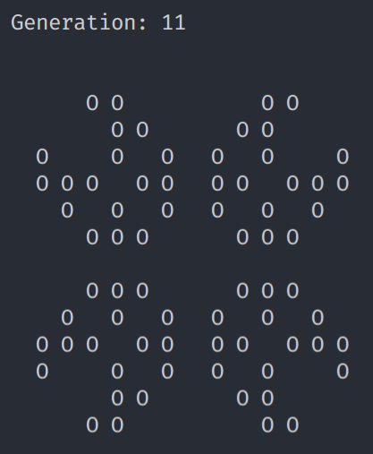

# Game of life

Simple implementation of Game of life.

## How to run

0. [Install stack](https://docs.haskellstack.org/en/stable/README/#how-to-install) if you don't have it installed
0. `git clone https://github.com/ErikCupal/game-of-life.git`
0. `cd game-of-life`
0. `stack setup`
0. `stack runghc -- src/Main.hs`
0. type location of a pattern, eg. `seeds/pulsar.txt`
